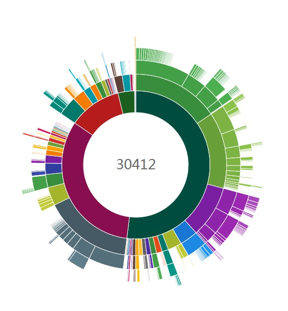
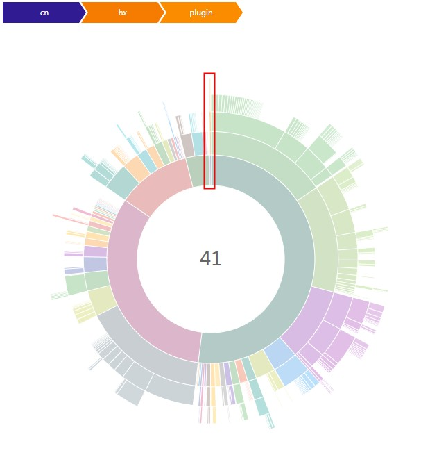

#  Android垃圾代码生成插件

此插件用于做马甲包时，减小马甲包与主包的代码相似度，避免被某些应用市场识别为马甲包。

### 使用方法

根目录的build.gradle中：
```
buildscript {
    repositories {
        mavenCentral()
    }
    dependencies {
        classpath "com.github.qq863966636:android-junk-code:x.x.x"
    }
}
```


app目录的build.gradle模块中：
```groovy
apply plugin: 'com.android.application'
apply plugin: 'android-junk-code'

androidJunkCode {
    variantConfig {
        release {//变体名称，如果没有设置productFlavors就是buildType名称，如果有设置productFlavors就是flavor+buildType，例如（freeRelease、proRelease）
            packageBase = "cn.hx.plugin.ui"  //生成java类根包名
            packageCount = 30 //生成包数量
            activityCountPerPackage = 3 //每个包下生成Activity类数量
            excludeActivityJavaFile = false //是否排除生成Activity的Java文件,默认false(layout和写入AndroidManifest.xml还会执行)，主要用于处理类似神策全埋点编译过慢问题
            otherCountPerPackage = 50  //每个包下生成其它类的数量
            methodCountPerClass = 20  //每个类下生成方法数量
            resPrefix = "junk_"  //生成的layout、drawable、string等资源名前缀
            drawableCount = 300  //生成drawable资源数量
            stringCount = 300  //生成string数量
        }
    }
}
```

如果有多个变体共用一个配置可以这样做
```groovy
androidJunkCode {
    def config = {
        packageBase = "cn.hx.plugin.ui"
        packageCount = 30
        activityCountPerPackage = 3
        excludeActivityJavaFile = false
        otherCountPerPackage = 50
        methodCountPerClass = 20
        resPrefix = "junk_"
        drawableCount = 300
        stringCount = 300
    }
    variantConfig {
        debug config
        release config
    }
}
```

如果APP开启了混淆，需要在混淆文件里配置

```
#cn.hx.plugin.ui为前面配置的packageBase
-keep class cn.hx.plugin.ui.** {*;}
```

### 生成文件所在目录
build/generated/source/junk

### 使用插件[methodCount](https://github.com/KeepSafe/dexcount-gradle-plugin)对比

#### 未加垃圾代码

**项目代码占比 0.13%**




#### 加了垃圾代码

**项目代码占比 52.93%**

